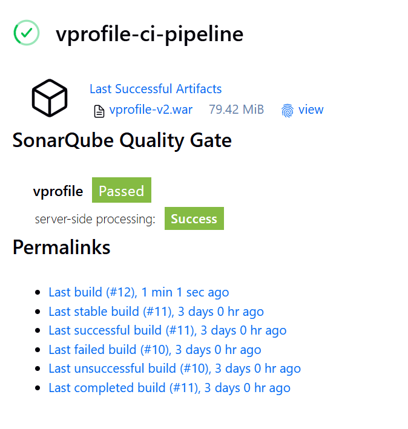
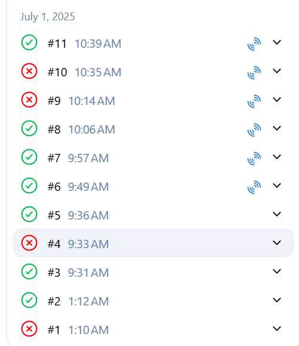
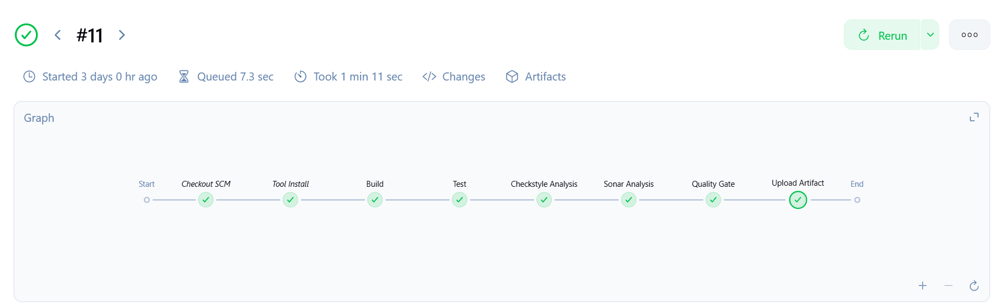
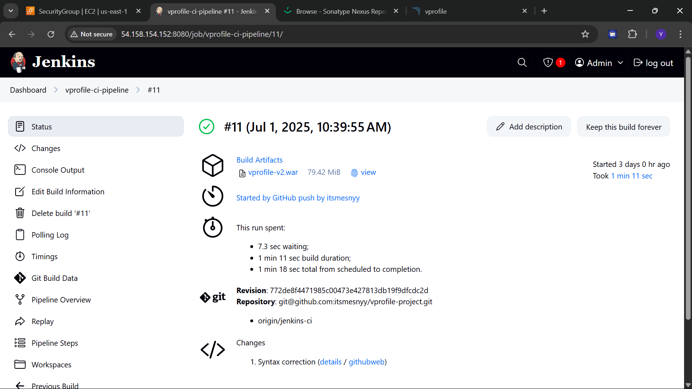
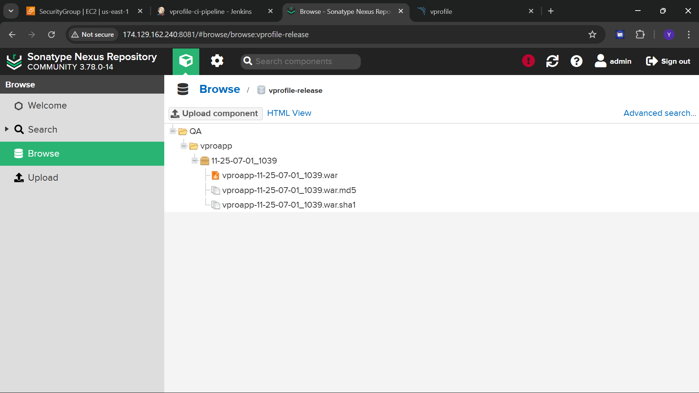
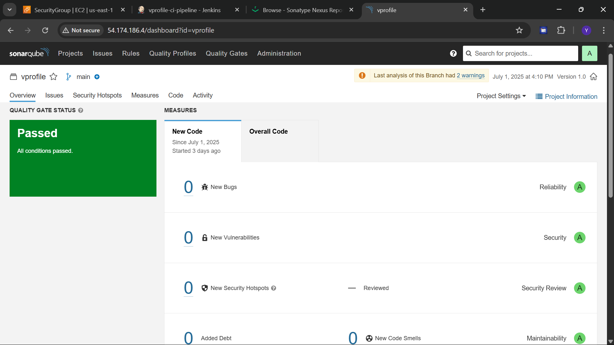

CI/CD PIPELINE WITH JENKINS, SONARQUBE, AND NEXUS
=================================================

PROJECT OVERVIEW
----------------
This project demonstrates a complete CI/CD pipeline using Jenkins, SonarQube, and Nexus Repository. 
The pipeline automates the following steps:

1. Code checkout from GitHub
2. Tool installation and build
3. Unit testing
4. Static code analysis with Checkstyle and SonarQube
5. Enforcing a SonarQube quality gate
6. Uploading the artifact to Nexus repository (only if quality gate passes)

PROJECT STRUCTURE
-----------------
- Jenkinsfile              : Defines pipeline stages
- pom.xml                  : Maven build configuration
- src/                     : Application source code
- README.txt               : Project documentation

TOOLS & TECHNOLOGIES USED
-------------------------
- Jenkins                  : CI/CD pipeline automation
- GitHub                   : Source code management
- Maven                    : Project build and dependency management
- Checkstyle               : Code style analysis
- SonarQube                : Static code analysis
- Nexus Repository Manager : Artifact storage

PIPELINE STAGES
---------------
1. Checkout SCM          : Clones the GitHub repository.
2. Tool Install          : Installs required tools (e.g., Maven, Java).
3. Build                 : Compiles the code using `mvn clean install`.
4. Test                  : Runs unit tests.
5. Checkstyle Analysis   : Validates code style using Checkstyle.
6. Sonar Analysis        : Sends analysis to SonarQube.
7. Quality Gate          : Waits for SonarQube's approval.
8. Upload Artifact       : Uploads the build artifact to Nexus if the quality gate is passed.

SCREENSHOT
----------
## 📸 Screenshots

### Jenkins Dashboard

### Jenkins Build List

### Jenkins Pipeline View

### Jenkins Job Configuration

### Nexus Repository View

### SonarQube Code Analysis

